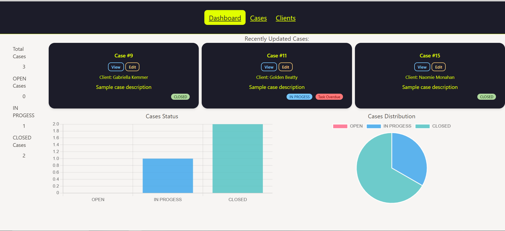
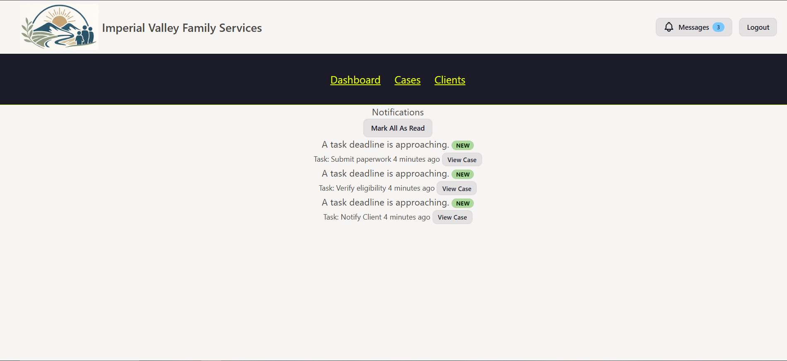
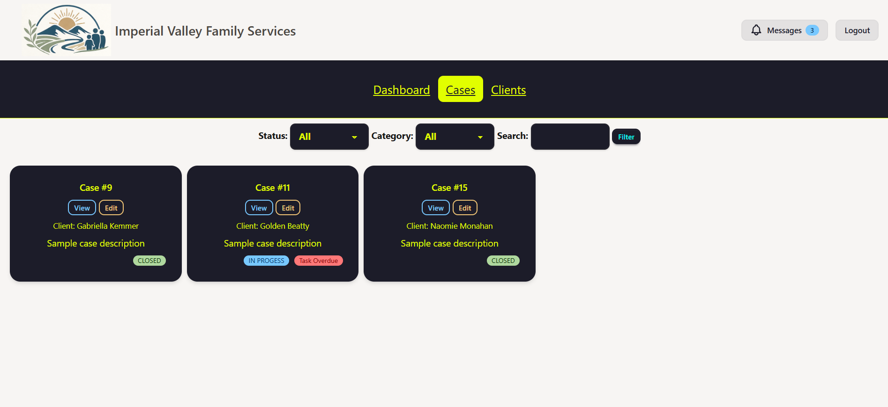
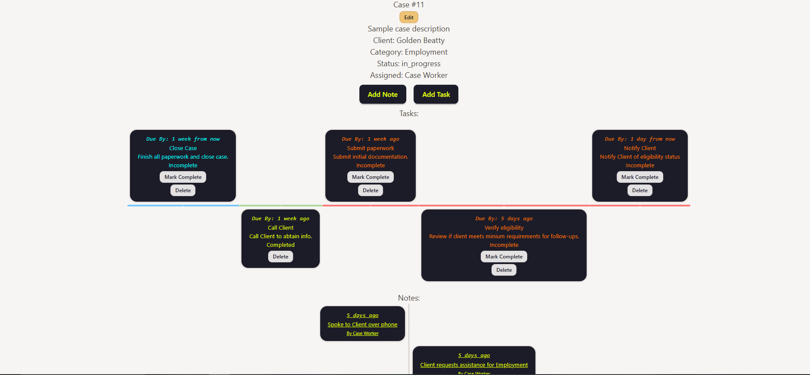

Case Management System
Portfolio Project – Backend Development

A web-based Case Management System designed to help organizations track, manage, and update cases efficiently. This application supports role-based access, case lifecycle tracking, and structured data management for real-world workflows.

Overview

This project simulates a production-style internal tool used by organizations such as legal offices, social services, or support teams to manage cases from creation to resolution.

It focuses on:
- Clean backend architecture
- Practical CRUD operations
- Role-based permissions
- Real-world data relationships
- Maintainable and scalable design

## Features

**Core Functionality**

- [x] Create, view, update, and delete cases
- [x] Assign cases to users (case workers/admins)
- [x] Track case status (Open, In Progress, Closed)
- [x] Add notes or updates to cases (case history)
- [x] Filter and search cases

**User Roles**

- Admin
   - Full access to all cases and users
- Case Worker
   - Manage assigned cases
   - Update case status and notes

**Additional Features (Planned / In Progress)**

- Dashboard with case statistics (charts)
- Pagination for large datasets
- Validation and error handling
- Activity log (audit trail)

**Tech Stack**

- Backend: Laravel (PHP)
- Frontend: Blade templates (Laravel)
- Database: MySQL
- Styling: Bootstrap / Tailwind (depending on implementation)
- Charts: Chart.js (for dashboard analytics)

**Database Structure**

- users
   - id, name, email, role, etc.
- cases
   - id, title, description, status, assigned_to, created_by
- case_notes
   - id, case_id, user_id, note, created_at

**Usage**

- Register or log in as a user
- Admins can create and assign cases
- Case workers can update assigned cases
- Use filters/search to manage large case lists

Admin: 
- admin@ivfs.com 
- password

Case Worker:
- cworker@ivfs.com 
- password

## Project Goals

This project is part of a structured career restart plan and demonstrates:

- Ability to design relational databases
- Understanding of MVC architecture (Laravel)
- Implementation of role-based access control
- Building real-world CRUD applications
- Writing clean, maintainable code

**Future Improvements**

- API integration (RESTful endpoints)
- File attachments for cases
- Notifications (email or in-app)
- Advanced reporting and exports (CSV/PDF)
- Unit and feature testing

## **Screenshots**


## Dashboard
View of Dashboard showcasing Recent Cases, Total Cases and thier status.


## Messages
View of Case Workers in App Messages



## Cases
Listing of all Cases with some optional filtering.

View of a Case info, with a horizontal timeline of Tasks and vertical timeline of Notes.



## ** Install **

- Clone Repo
```
   git clone https://github.com/cgatlin/cms.git
   cd cms
```
- Install Dependancies
```
   composer install
   npm install
```
- Enviroment setup
```
   cp .env.example .env
   php artisan key:generate
```
- Database setup (if Not using sqlite)
   - edit .env
```
   DB_CONNECTION=mysql
   DB_HOST=127.0.0.1
   DB_PORT=3306
   DB_DATABASE=case_management_system
   DB_USERNAME=root
   DB_PASSWORD=your_password
```
   - run migration and seeders
```
   php artisan migrate:fresh --seed
```
- Build FrontEnd Assets
```
npm run build
```
- Start Server
```
php artisan serve
```
Application will run at:
http://127.0.0.1:8000

- Optional Command for Messages
```
php artisan app:send-task-reminders
```
## Demo Login Credentials
Admin: 
- admin@ivfs.com 
- password

Case Worker:
- cworker@ivfs.com 
- password